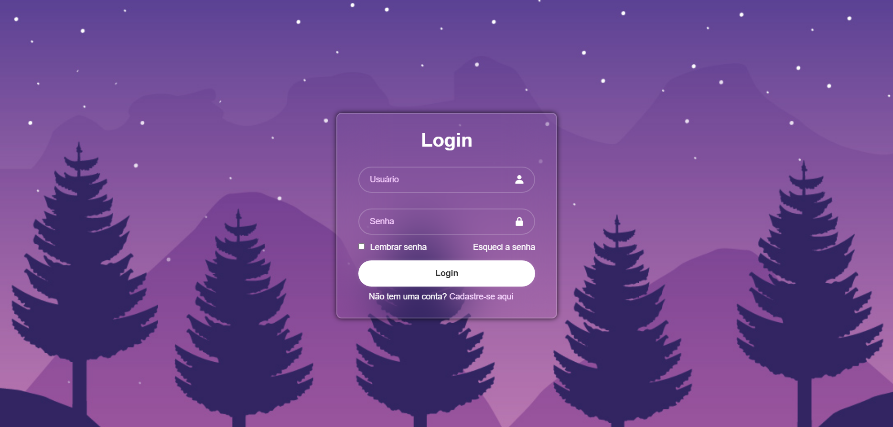

# Projeto  Tela de Login Usuário com HTML e CSS

O sistema em questão foi feito para ser utilizado em alguma aplicação em Login de Usuário ou novo Cadastro de Usuários. A ferramenta é construído totalmente em HTML e CSS. Essa aplicação reforcou meus conhecimentos e estudos em referência às aplicações em Front-End. Tive também a oportunidade de aprender essa estruturação com a DevClub | Programação - Canal no Youtube que me ajudou no desenvolvimento dessa aplicação.

## English Version

The system in question was designed to be used in some application for User Login or new User Registration. The tool is built entirely in HTML and CSS. This application reinforced my knowledge and studies regarding Front-End applications. I also had the opportunity to learn this structure with DevClub | Programação - YouTube Channel, which helped me develop this application.
## Imagem do Site de Login

## Ferramentas usadas

- Visual Studio Code
- HTML e CSS
- Google Fonts
- UNPKD (Ícones) 

